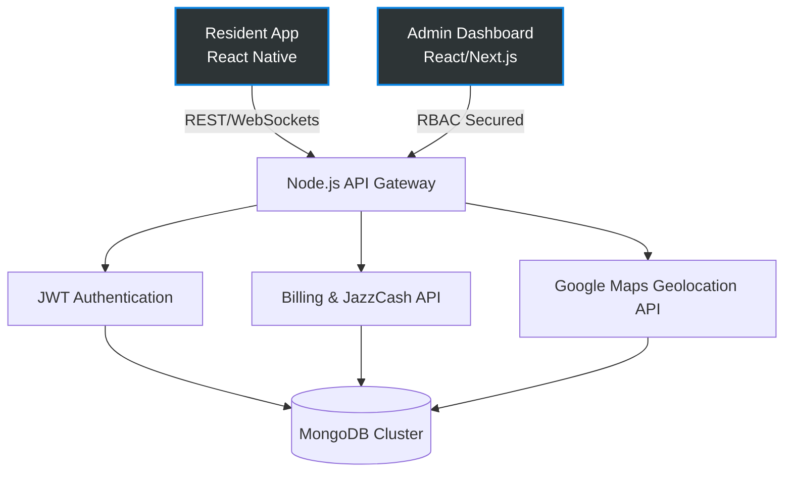

# 🏙️ UrbanEase | Smart Society Management Platform

> **A comprehensive cross-platform mobile & web ecosystem for residential society management, serving 100+ active residents.**

UrbanEase automates billing, complaint tracking, and emergency response workflows. By integrating real-time database synchronization and geolocation APIs, it drastically reduces task resolution time and improves community engagement.

## 🏗️ System Architecture

## 🚀 Key Features
- **Multi-Role RBAC Dashboards:** Strict data isolation and tiered access control for Residents, Staff, and Administrators.
- **Automated Billing & Payments:** Integrated JazzCash gateway for seamless maintenance fee collection and reconciliation.
- **Real-Time Complaint Tracking:** Geolocation-tagged complaints with live status updates and WebSockets synchronization.
- **Emergency Response Workflows:** One-tap SOS triggers instantly alerting society security with live location tracking.

## 🛠️ Tech Stack
- **Frontend:** React Native (Mobile), React.js / Next.js (Web Admin)
- **Backend:** Node.js, Express.js
- **Database:** MongoDB
- **Integrations:** Google Maps API, JazzCash Payment Gateway

## 🔒 Security
Zero unauthorized access incidents post-launch. All API endpoints are secured with rotating JWTs and strict Role-Based Access Control (RBAC) middleware.

---
*Engineered by [Suham Iqbal Khan](https://github.com/Suham) | Ecosystem Builder & Full-Stack Architect.*
